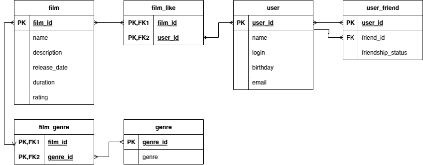

## Проект "Filmorate"

Данное приложение реализовано при помощи Spring Boot и работает через интернеты.

В этом приложении есть:

* Пользователи
  1. Можно создать пользователя
  2. Отредактировать существующего
  3. Удалить
  4. Добавить в друзья другого пользователя
  5. Удалить из друзей
  6. Запросить пользователя

* Фильмы
    1. Можно создать фильм
    2. Отредактировать существующий
    3. Удалить
    4. Поставить лайк фильму
    5. Удалить лайк
    6. Запросить список фильмов
    7. Запросить ТОП-%число% фильмов по количеству лайков. При пустом запросе возвращается первые 10 фильмов (или меньше, если в базе их меньше)


Приложение написано на Java. Пример кода:
```java
public class Practicum {
    public static void main(String[] args) {
    }
}
```
------
Схема базы данных для приложения:



Примеры запросов:

* Получение списка пользователей:
```
 SELECT *
 FROM user
```

* Получение списков друзей всех пользователей:
```
SELECT u.user_id,
       uf.friend_id
FROM user AS u
LEFT JOIN user_friend AS uf ON u.user_id=uf.user_id
ORDER BY u.user_id;
```

* Получение списка общих друзей с другим пользователем:
```
SELECT uf.friend_id
FROM user AS ou
INNER JOIN user_friend AS uf ON ou.user_id=uf.user_id
INNER JOIN (SELECT u.user_id,
                   uf.friend_id
            FROM user AS u
            INNER JOIN user_friend AS uf ON u.user_id=uf.user_id
            WHERE u.user_id=1) AS u ON uf.friend_id=u.friend_id
WHERE u.user_id=3;
```

* Получение списка всех фильмов:
```
 SELECT *
 FROM film
```

* Получение списка всех фильмов с упорядочиванием по рейтингу:
```
SELECT *
FROM film
ORDER BY rating;
```

* Получение списка всех фильмов жанра 'Хоррор':
```
SELECT f.name
FROM film AS f
INNER JOIN film_genre AS fg ON f.film_id=fg.film_id
INNER JOIN genre AS g ON fg.genre_id=g.genre_id
WHERE g.genre='Хоррор'
ORDER BY f.name;
```

* Получение ТОП-10 фильмов по количеству лайков:
```
SELECT f.name,
       COUNT(fl.user_id) AS like_amount
FROM film AS f
INNER JOIN film_like AS fl ON f.film_id=fl.film_id
GROUP BY f.name
ORDER BY like_amount
LIMIT 10;
```